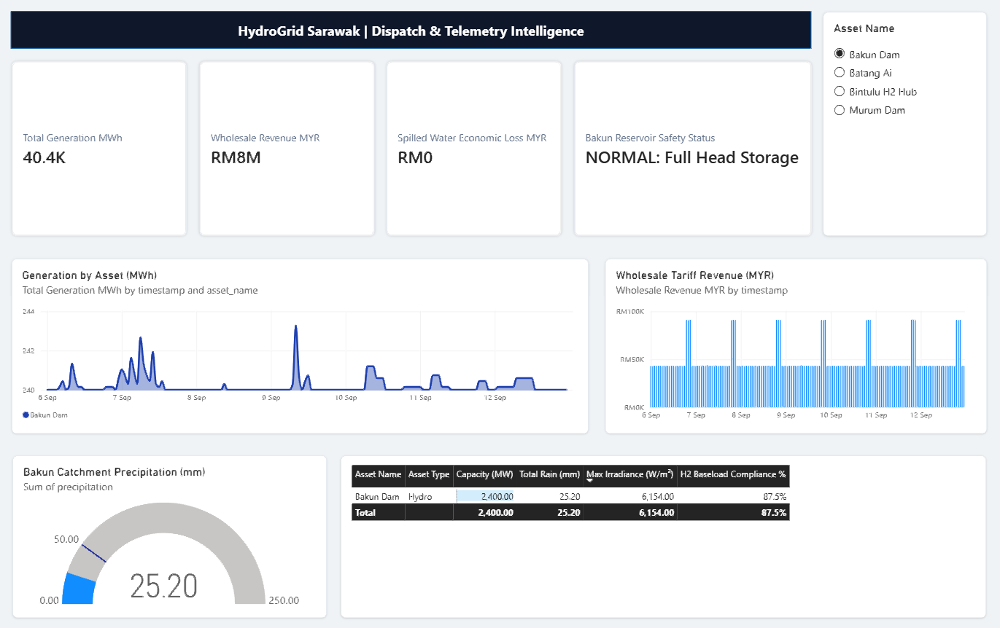
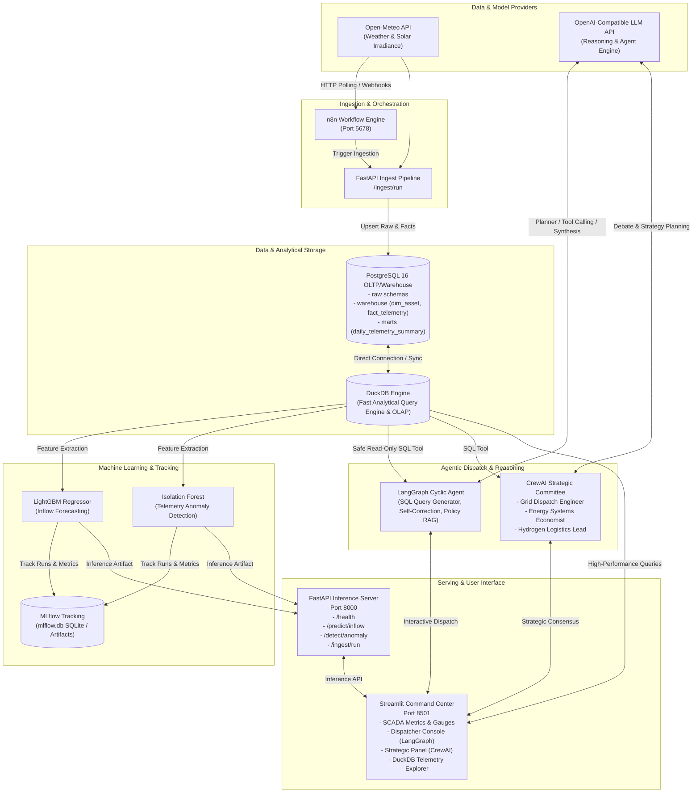

# HydroGrid Sarawak ⚡
> Autonomous Renewable Energy & Green Hydrogen Intelligence Platform

HydroGrid Sarawak is an end-to-end telemetry analytics, predictive forecasting, and autonomous grid dispatch platform designed for Sarawak's renewable hydropower and green hydrogen ecosystem (Bakun Dam, Murum Dam, Batang Ai, and Bintulu H2 Hub).



---

## System Architecture



---

## Core Components

| Component | Path / Technology | Description |
|-----------|-------------------|-------------|
| **OLTP & Warehouse** | PostgreSQL 16 / SQLAlchemy | Star-schema storing grid dimensions (`dim_asset`), telemetry time series (`fact_telemetry`), and analytical marts (`daily_telemetry_summary`). |
| **Analytical Engine** | DuckDB | Embedded in-process OLAP engine for zero-overhead analytical scans and read-only SCADA queries. |
| **Inference API** | `src/hydrogrid/serving/app.py` (FastAPI) | Exposes endpoints for LightGBM catchment inflow prediction, Isolation Forest anomaly scoring, and pipeline ingestion triggers. |
| **Autonomous Dispatcher** | `src/hydrogrid/agents/graph.py` (LangGraph) | Cyclic state graph with self-correcting SQL execution, policy RAG (Sarawak Energy frameworks), and operational synthesis. |
| **Strategic Panel** | `src/hydrogrid/agents/crew_panel.py` (CrewAI) | Multi-persona strategic planning team (Dispatch Engineer, Energy Economist, Hydrogen Logistics Lead) balancing grid stability, power tariffs, and electrolyzer load. |
| **Command Center** | `src/hydrogrid/ui/dashboard.py` (Streamlit) | Real-time operations dashboard featuring live SCADA gauges, agent chat, strategic deliberations, and DuckDB querying. |
| **Model Registry** | `src/hydrogrid/ml/` (MLflow, LightGBM, Scikit-learn) | Training pipelines and artifact storage for inflow regression and telemetry anomaly detection. |
| **Orchestration** | `docker-compose.yml` (n8n) & `k8s/` | Automated scheduled ingestion flows via n8n and Kubernetes manifests for cloud deployment. |

---

## Quickstart (Local Docker)

### 1. Environment Setup
Copy the environment template and configure secrets:
```bash
cp .env.example .env
```

Key environment variables:
- `POSTGRES_DB`, `POSTGRES_USER`, `POSTGRES_PASSWORD`: Database credentials.
- `OPEN_METEO_BASE_URL`: Forecast provider endpoint (default: `https://api.open-meteo.com`).
- `LLM_BASE_URL`, `LLM_API_KEY`: Endpoint and API key for OpenAI-compatible LLM service.

### 2. Launch with Docker Compose
Start PostgreSQL, FastAPI, Streamlit, and n8n:
```bash
docker compose up -d --build
```

### 3. Service Endpoints
- **Streamlit Command Center**: [http://localhost:8501](http://localhost:8501)
- **FastAPI Documentation**: [http://localhost:8000/docs](http://localhost:8000/docs)
- **n8n Workflow Automation**: [http://localhost:5678](http://localhost:5678)
- **PostgreSQL Warehouse**: `localhost:5432`

---

## Local Development & Testing

### Python Environment
Ensure Python 3.11+ is installed, then install dependencies:
```bash
pip install -e .
```

### Run Serving Microservice Locally
```bash
uvicorn hydrogrid.serving.app:app --host 0.0.0.0 --port 8000 --reload
```

### Run Streamlit Command Center
```bash
streamlit run src/hydrogrid/ui/dashboard.py
```

### Ingest Live Telemetry
Trigger an on-demand Open-Meteo telemetry sync:
```bash
curl -X POST http://localhost:8000/ingest/run
```

---

## Kubernetes Deployment

Deploy the stack to a Kubernetes cluster using the provided manifests in `k8s/`:

```bash
kubectl apply -f k8s/00-config.yaml
kubectl apply -f k8s/01-postgres.yaml
kubectl apply -f k8s/02-services.yaml
```

Verifying deployment status:
```bash
kubectl get pods -n hydrogrid
```
